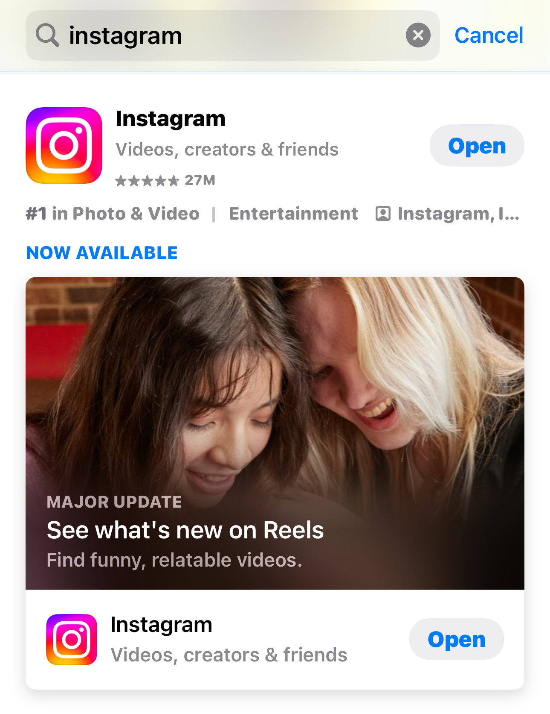
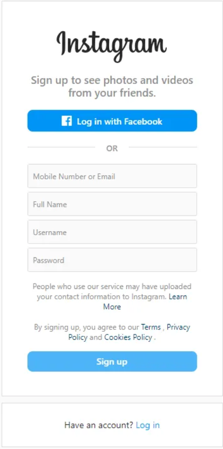
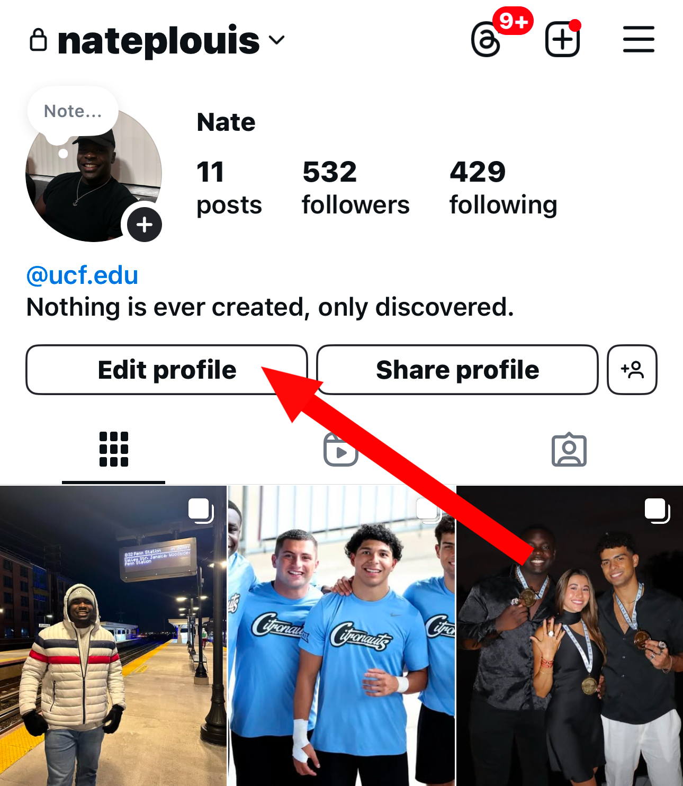

[Home](index.md) | [Manual Assessment Memo](manual_assessment_memo.md) | [Chatbot](chatbot.md) | [Procedure Video](procedure_video.md) | [Manual](manual.md) | [Reflective Blogs](reflective_blogs.md) 

# Table of Contents 
1. [Wayback Analysis](#wayback-analysis)
2. [Quick Start Guide](#quick-start-guide)
3. [Reflective Blog 3](#reflective-blog-3)
4. [Reflective Blog 4](#reflective-blog-4)
5. [Reflective Blog 5](#reflective-blog-5)
6. [Reflective Blog 6](#reflective-blog-6)
7. [Reflective Blog 7](#reflective-blog-7)
8. [Reflective Blog 8](#reflective-blog-8)

# Wayback Analysis

## Analysis of YouTube's 2005 Website

### 1. First Impressions  
The 2005 YouTube homepage feels super basic compared to today. The layout has simple tabs like "Home," "Favorites," and "Videos" at the top, and the login section is front and center. The design is plain, functional, and completely reliant on Adobe Flash Player, which is outdated now. It’s clear there wasn’t much focus on visuals or user experience.

### 2. What Stood Out  
- **Flash Dependency**: The “Flash Player is no longer supported” error really shows its age. Modern sites use HTML5 instead.  
- **No Thumbnails**: There are no images or video previews—something we now take for granted.  
- **Static Design**: The layout doesn’t adapt to different screen sizes, which would feel unusable on a phone or tablet today.  

### 3. Modern Standards vs. Then  
Today’s websites are polished, responsive, and filled with dynamic content. I open YouTube and expect personalized video recommendations, seamless playback, and an easy-to-navigate layout. This old version feels clunky and sterile compared to the YouTube I know now. It's so streamlined that unless I had something specific in mind, I can just open YouTube and have hours of content I like displayed to me without having to search for something.  

### 4. Overall Experience  
Looking at the site now is shocking because it seems like the websites back then were super functional. It was home, menu, and whatever the site provided. I enjoy the modern touch and seamless design of modern-day websites, but the old-school websites really do have a fun retro feel. They remind me of hacker tutorial websites or cyberpages where the information can be insane but is delivered in a functional feel.  

---
# Quick Start Guide

## How to Set Up and Start Using Instagram: A Quick-Start Guide  
**Product**: Instagram (Mobile App)  
**Audience**: Complete beginners who have never used Instagram before.  

Instagram is a social media platform for sharing photos, videos, and stories. This guide will help you set up your account and start using the app.

### Step-by-Step Instructions  

#### Step 1: Download the Instagram App  
1. Open the **App Store** (iPhone) or **Google Play Store** (Android) on your phone.  
2. Tap the **Search Bar** at the top of the screen.  
3. Type “Instagram” and tap **Search**.  
4. Tap **Install** (Android) or **Get** (iPhone) to download the app.  

  
*Figure 1. Search for Instagram in the App Store.*

#### Step 2: Open Instagram and Sign Up  
1. Locate and tap the **Instagram icon** on your home screen to open the app.  
2. Tap **Sign Up**.  
3. Enter your email address or phone number, then tap **Next**.  
4. Create a username and password, then tap **Next**.  

  
*Figure 2. Instagram sign-up screen.*  

#### Step 3: Complete Your Profile  
1. Tap **Add Profile Photo** to upload a picture from your phone (optional).  
2. Tap **Next** to skip connecting to friends (you can do this later).  
3. Tap **Done** to finish setup.  

  
*Figure 3. Profile setup screen.*    

#### Step 4: Start Using Instagram  
- **Home Screen**: Scroll to see posts from accounts you follow.  
- **Search Icon (🔍)**: Tap to find friends or explore content.  
- **Plus Icon (+)**: Tap to post a photo or video.  
- **Heart Icon (❤️)**: Tap to view notifications.  
- **Profile Icon (👤)**: Tap to edit your profile or settings.  

### Tips for New Users  
- Use the **Explore Page** (magnifying glass icon) to discover trending posts.  
- Tap **Stories** at the top of your home screen to view updates from friends.  
- To log out, go to your profile, tap the menu icon (☰), and select **Log Out**.

---
# Reflective Blog 3  

## Prompt
A: Reflect on your assigned reading this week in a detailed manner that demonstrates you read and understood the assigned reading. What can you 'take away' from this reading? What insightful concepts did you read about that can inform your own technical communication activities? 

## Response

This week’s reading emphasized structuring digital content for usability. A key takeaway was shifting from a *document mindset* to an *information mindset*—users seek quick answers, not dense manuals. The reading compared effective web content to **index cards**, where each section provides concise, relevant details instead of overwhelming users with large blocks of text.  

A major insight was **thoughtful content division**, ensuring information is organized by user needs, whether by **questions, tasks, product types, audience, or sequential steps**. The reading also highlighted the importance of **concise web pages**, balancing content length for readability, mobile-friendliness, and printability.  

Another critical point was **using PDFs sparingly**—they are often inaccessible, difficult to navigate, and not mobile-friendly. Web-based formats with clear pathways improve user experience.  

### Application to Technical Communication  

For IT and cybersecurity documentation, these principles improve clarity and accessibility. I will:  

- **Structure content for quick navigation** (e.g., FAQs, step-by-step guides).  
- **Use clear headings and pathways** for better readability.  
- **Minimize reliance on PDFs** in favor of accessible web content.  
- **Focus on concise, user-centered writing**.  

This reading reinforced that **effective technical communication isn’t just about delivering information—it’s about ensuring users can easily find and use it.**  

## Tools Used

ChatGPT-4o

## Prompt Used: 

"I wrote this reflection on this week’s reading, but I want to make sure it follows the 'shorter is better' model of technical writing. Please review it for clarity, remove unnecessary filler, and revise it to be more concise while still retaining key takeaways. If anything is unclear, adjust it for better readability."

## Prompt Revisions

The initial response was too detailed for the 'shorter is better' model, so I revised it to be more concise, removing redundancy while ensuring key takeaways remained clear and actionable.

---
# Reflective Blog 4  

## Prompt

Prompt C: Ask a generative AI tool (maybe one in Boodlebox or Copilot) to generate something you might have to write in your future career. Assess the result, and then revise your prompt or "stack" an additional prompt onto it (e.g., "remove the passive voice and add headings"). Congratulations, you're a prompt engineer now. Add this skill to your resume. On your website, post: 1) your original and revised prompts 2) your assessment of what it generated 3) (optional) what it generated

## Response

Original Prompt:
"Generate a professional email educating employees about phishing attacks. The email should be clear, concise, and include examples of common phishing attempts, warning signs, and best practices for avoiding them."

Revised Prompt:
"Generate a professional yet engaging phishing awareness email for employees. Use a friendly and clear tone. Include bullet points for key takeaways, a short real-world example of a phishing email, and a direct call to action (e.g., 'Report suspicious emails to IT'). Avoid passive voice and ensure it remains concise."

Assessment:
The first version was informative but too formal and not engaging enough. After refining the prompt, the output was clearer, more actionable, and better suited for a company-wide email.

## Generated Email

### **Subject:** 🚨 Stay Alert! How to Spot and Report Phishing Emails  

Dear [Company Name] Team,  

Cybercriminals are constantly trying to trick employees into clicking malicious links or sharing sensitive information. These phishing emails can appear legitimate, but a few key signs can help you identify and avoid them.  

#### **🚫 How to Spot a Phishing Email:**  
- **Urgent or threatening language** (e.g., “Your account will be suspended!”)  
- **Unfamiliar sender or email address** (e.g., slight misspellings like support@amaz0n.com)  
- **Suspicious links** – Hover over them before clicking to check the actual URL  
- **Unexpected attachments** – Could contain malware  
- **Requests for sensitive information** – IT or HR will never ask for your password via email  

#### **📌 Example of a Phishing Email:**  

**🚩 Subject:** “URGENT: Password Reset Required”  
**🚩 From:** it-support@yourcompany-secure.com  
**🚩 Message:**  

*"Your account has been compromised. Click below to reset your password immediately."*  
**[Click Here to Reset]** (🚨 Fake link)  

#### **✅ What to Do If You Receive a Suspicious Email:**  
✔ **DO NOT** click on links or open attachments  
✔ **DO NOT** reply or provide any personal information  
✔ **DO** report it immediately to IT by forwarding the email to **[IT Support Email]**  

Cybersecurity is a shared responsibility. By staying alert, you help protect yourself and the company. If you have any questions, feel free to reach out to IT at **[IT Support Contact]**.  

**Stay safe,**  
[Your Name]  
[Your Role]  
[Company Name IT Security Team]  

## Tools Used

ChatGPT-4o model used as the generative AI tested. The prompt and revisions are above.

---
# Reflective Blog 5  
## Prompt  

Prompt D: Explore an online tutorial, manual, or reference guide/FAQ page. Give it an honest but professional assessment. Describe in your post the aspects of the page(s) that are effective, and explain why. Describe the aspects of the page(s) that are ineffective, and explain why. Keep a professional tone, as though you expect the author(s) of the page(s) to read your post.  

## Response  

### **Assessment of PCMag's "How to Build a PC: The Ultimate Beginner's Guide"**  

PCMag's **"How to Build a PC: The Ultimate Beginner's Guide"** serves as a comprehensive resource for individuals venturing into PC assembly. The guide meticulously details each step of the building process, from selecting compatible components to the actual assembly, ensuring readers grasp both the theoretical and practical aspects of PC construction.  

### **Effective Aspects:**  

1. **Structured Layout:**  
   The guide's logical progression—from component selection to assembly—provides readers with a clear roadmap, minimizing potential confusion.  

2. **Visual Aids:**  
   Incorporating high-quality images and diagrams enhances comprehension, allowing readers to visualize each step and component accurately.  

3. **Component Compatibility Emphasis:**  
   The guide underscores the importance of selecting compatible components, a critical aspect for beginners to ensure a functional build.  

4. **Comprehensive Coverage:**  
   Addressing both hardware assembly and software installation offers a holistic view of the PC building process, preparing readers for all facets of the task.  

### **Ineffective Aspects:**  

1. **Technical Jargon:**  
   While detailed, the guide occasionally employs technical terminology without sufficient explanation, which might be daunting for absolute beginners.  

2. **Assumed Prior Knowledge:**  
   Certain sections presume a basic understanding of computer hardware, potentially alienating readers entirely new to the subject.  

3. **Limited Troubleshooting Guidance:**  
   The guide could benefit from a dedicated section on common issues and troubleshooting tips during assembly and initial boot-up.  

### **Final Thoughts:**  

PCMag's guide stands as a **valuable resource** for aspiring PC builders. By refining explanations of technical terms and incorporating more beginner-friendly language, it could further enhance its accessibility and effectiveness. Adding a troubleshooting section and step-by-step video guides would further improve the experience for readers. If interested you can visit the article <a href="https://www.pcmag.com/how-to/how-to-build-a-pc-the-ultimate-beginners-guide"> here </href> for more information!  

## Tool Used  

ChatGPT-4o was used to help analyze my bullet point summary of the guide.  

## Revisions/Re-Prompting  

A revision was made to ensure the response was concise and structured for readability while maintaining a professional tone.  

---
# Reflective Blog 6  
TBD  

---
# Reflective Blog 7  
TBD  

---
# Reflective Blog 8  
TBD  

## AI DISCLAIMER  
Some text edited by ChatGPT 4o Model.
